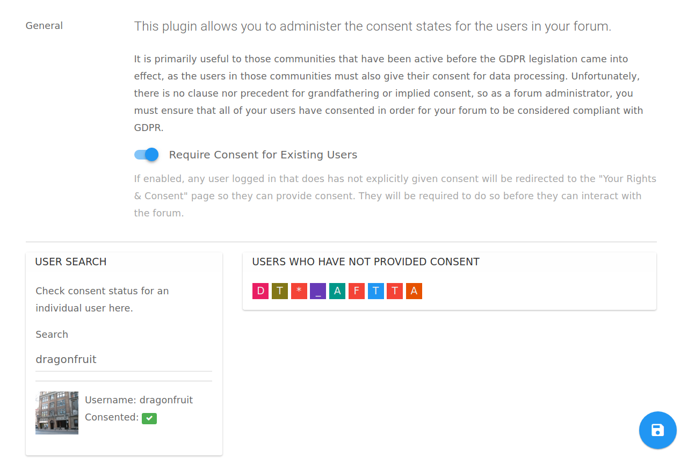

# GDPR Plugin for NodeBB

This plugin allows an administrator to properly audit their existing userbase on their forum for GDPR compliance.

The main aim for GDPR is to receive consent from every single user accessing your website.

By default, NodeBB will present new users with an outline of GDPR rules and their rights, and require their consent before continuing onwards.

However, existing users will continue to access the site even though they have not provided consent. This plugin will allow you to transparently obtain consents from those users, and allow you to maintain a list of users who have not consented, if you wish to delete them in order to maintain compliance.

**Figure 1** &mdash; The Admin Control Panel page for the plugin